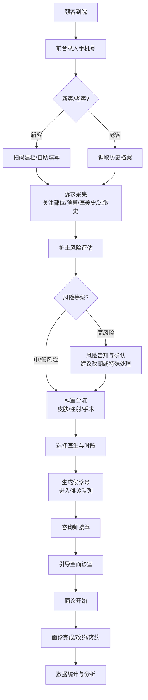

# 医美初诊分诊导诊工作台 - 产品需求文档

## 1. 产品概述

医美初诊分诊导诊 Web 工作台是面向中大型医美机构的前台接待、现场咨询师和分诊护士的专业工作平台，旨在优化首次到院顾客从进门登记到进入面诊室的全流程体验，减少顾客反复询问和错分诊问题，提升机构运营效率和服务品质。

- **核心价值**：通过标准化分诊流程、智能风险提示和可视化候诊队列，提升高峰期接诊效率，降低错分诊率
- **目标用户**：前台接待人员、现场咨询师、分诊护士
- **使用场景**：中大型医美机构高峰期（周末、节假日、促销活动期）

## 2. 核心功能

### 2.1 用户角色

| 角色 | 登录方式 | 核心权限 |
|------|----------|----------|
| 前台接待 | 工号登录 | 到院登记、扫码建档、拍照确认、发送候诊号、标记爽约/改约 |
| 分诊护士 | 工号登录 | 诉求审核、风险评估、科室分流、补充信息提醒、统计查看 |
| 现场咨询师 | 工号登录 | 候诊队列接单、顾客信息查看、面诊状态更新、接诊时段管理 |

### 2.2 功能模块

1. **到院登记页面**：手机号录入、扫码建档、拍照身份确认、基本信息填写
2. **诉求采集页面**：关注部位选择、预算区间设置、过往医美史记录、过敏史记录
3. **风险提示页面**：孕期/哺乳期禁忌提示、过敏史警示、禁忌症自动检测、风险等级标注
4. **科室分流页面**：皮肤类/注射类/手术类分诊、医生可接诊时段展示、智能推荐科室
5. **候诊队列页面**：候诊号码生成、队列实时状态、咨询师接单、面诊室分配
6. **导诊看板页面**：全局候诊状态、路线指引发送、缺项提醒、爽约/改约管理、耗时统计

### 2.3 页面详情

| 页面名称 | 模块名称 | 功能描述 |
|----------|----------|----------|
| 到院登记 | 快速登记 | 手机号快速录入、自动检测老客/新客 |
| 到院登记 | 扫码建档 | 生成建档二维码、顾客扫码自助填写 |
| 到院登记 | 身份确认 | 拍照功能、人脸比对确认、证件OCR（可选） |
| 到院登记 | 基本信息 | 姓名、年龄、性别、联系方式等基础信息 |
| 诉求采集 | 关注部位 | 面部/身体部位可视化选择、多选支持 |
| 诉求采集 | 预算区间 | 多档位预算选择、自定义金额输入 |
| 诉求采集 | 医美史 | 过往项目记录、时间、机构、效果评价 |
| 诉求采集 | 过敏史 | 药物/材料过敏记录、严重程度标注 |
| 风险提示 | 禁忌检测 | 孕期/哺乳期自动识别、禁忌症匹配 |
| 风险提示 | 风险等级 | 高/中/低风险分级、颜色标识 |
| 风险提示 | 护士确认 | 护士审核签字、风险告知确认 |
| 风险提示 | 处理建议 | 对应风险的处理建议和注意事项 |
| 科室分流 | 科室分类 | 皮肤类/注射类/手术类三大分类 |
| 科室分流 | 医生排班 | 各科室医生列表、可接诊时段展示 |
| 科室分流 | 智能推荐 | 根据诉求和预算推荐合适科室/医生 |
| 科室分流 | 分流确认 | 护士确认分流、生成候诊号码 |
| 候诊队列 | 队列展示 | 按科室分列展示候诊列表、实时状态更新 |
| 候诊队列 | 咨询师接单 | 咨询师主动接单、叫号功能 |
| 候诊队列 | 面诊室分配 | 自动分配面诊室、支持手动调整 |
| 候诊队列 | 状态流转 | 待接诊→接诊中→已完成/已改约/已爽约 |
| 导诊看板 | 全局概览 | 今日到院数、候诊数、接诊中、已完成统计 |
| 导诊看板 | 路线指引 | 一键发送面诊室路线到顾客手机 |
| 导诊看板 | 缺项提醒 | 信息不完整顾客高亮提醒、通知补充 |
| 导诊看板 | 爽约改约 | 标记爽约/改约、备注原因 |
| 导诊看板 | 耗时统计 | 初诊转面诊平均耗时、各环节时长分布 |

## 3. 核心流程

### 3.1 主流程描述

顾客到院后，前台接待首先录入手机号进行快速登记，系统自动判断是新客还是老客。新客可通过扫码建档在平板上自助填写基本信息和诉求，或由前台协助录入。完成登记后，分诊护士对顾客进行风险评估，查看过敏史、孕期/哺乳期等禁忌信息，确认风险等级。随后根据顾客诉求进行科室分流（皮肤类/注射类/手术类），查看医生可接诊时段并分配到对应科室的候诊队列。咨询师在候诊队列中接单，将顾客引导至面诊室。整个过程中，导诊看板提供全局视角，支持发送路线指引、缺项提醒、爽约改约等操作，并统计各环节耗时数据。

### 3.2 流程图

## 4. 用户界面设计

### 4.1 设计风格

- **整体风格**：专业医疗 + 轻奢优雅，体现医美行业的专业感和高端感
- **主色调**：深蓝灰色（#1E3A5F）作为主色，传达专业与信任
- **辅助色**：玫瑰金（#D4A574）作为点缀色，体现轻奢与品质
- **状态色**：
  - 成功/正常：薄荷绿（#3DCCA8）
  - 警告/中风险：琥珀黄（#FFB020）
  - 危险/高风险：珊瑚红（#FF6B6B）
  - 信息/待处理：天空蓝（#4DA8DA）
- **中性色**：从纯白到深灰的多层次中性色阶，保证内容可读性
- **按钮风格**：圆角矩形按钮，主按钮使用渐变效果，悬停有微动画
- **字体**：
  - 标题：思源黑体 Bold，字号层次分明
  - 正文：思源黑体 Regular，保证阅读舒适度
  - 数字/数据：等宽字体，提升数据可读性
- **布局风格**：左侧导航 + 右侧内容区的经典工作台布局，卡片式内容展示
- **图标风格**：线性图标为主，关键功能使用填充图标，保持统一风格
- **卡片风格**：圆角卡片，柔和阴影，悬停时有轻微上浮效果
- **数据展示**：使用进度条、环形图、状态标签等可视化元素

### 4.2 页面设计概览

| 页面名称 | 模块名称 | UI 元素 |
|----------|----------|---------|
| 到院登记 | 快速登记区 | 大号手机号输入框、扫码按钮、新客老客切换标签 |
| 到院登记 | 信息表单 | 分组表单卡片、头像上传区、拍照确认按钮 |
| 到院登记 | 快捷操作 | 右侧悬浮快捷操作栏、生成候诊号按钮 |
| 诉求采集 | 部位选择 | 人体/面部示意图、可点击热点区域、已选标签 |
| 诉求采集 | 预算选择 | 滑块组件、预设档位按钮、自定义输入 |
| 诉求采集 | 历史记录 | 时间线布局、可添加/删除记录项 |
| 诉求采集 | 过敏史 | 标签式选择、严重程度选择器、备注输入 |
| 风险提示 | 风险概览 | 风险等级徽章、风险项列表、颜色编码 |
| 风险提示 | 禁忌检测 | 醒目的警示卡片、孕期/哺乳期快速选择 |
| 风险提示 | 护士确认 | 电子签名区、确认按钮、风险告知文本 |
| 科室分流 | 科室选择 | 三大科室卡片、图标+文字、选中高亮效果 |
| 科室分流 | 医生列表 | 医生头像、姓名、职称、可接诊时间、预约按钮 |
| 科室分流 | 智能推荐 | 推荐理由标签、匹配度百分比、优先排序 |
| 候诊队列 | 队列看板 | 三列布局（皮肤/注射/手术）、候诊卡片瀑布流 |
| 候诊队列 | 叫号操作 | 接单按钮、叫号按钮、面诊室分配下拉 |
| 候诊队列 | 状态标签 | 不同颜色的状态徽章、等待时长计时 |
| 导诊看板 | 数据概览 | 顶部统计卡片、关键指标大字展示、趋势箭头 |
| 导诊看板 | 全局队列 | 压缩版队列视图、快速操作按钮 |
| 导诊看板 | 缺项提醒 | 红色角标提醒、一键通知功能 |
| 导诊看板 | 耗时统计 | 柱状图/折线图、平均耗时、各环节分布 |

### 4.3 响应式设计

- **设计原则**：桌面端优先，兼顾平板端适配
- **主屏幕**：1920×1080 及以上分辨率为主要设计目标
- **侧边栏**：在小屏幕上可折叠为图标模式或隐藏
- **内容区**：使用自适应网格布局，卡片可自动换行
- **平板适配**：支持横屏使用，优化触控交互区域
- **不做移动端**：本系统为工作台产品，主要在桌面端和平板端使用

### 4.4 动效与交互

- **页面切换**：淡入淡出 + 轻微位移动画，过渡自然
- **卡片悬停**：轻微上浮 + 阴影加深，提升可点击感知
- **状态变化**：颜色渐变过渡，避免突兀的状态切换
- **数据更新**：数字滚动动画、进度条平滑过渡
- **加载状态**：骨架屏 + 脉冲动画，保持视觉连贯性
- **按钮交互**：点击时有微缩放效果，提供即时反馈

