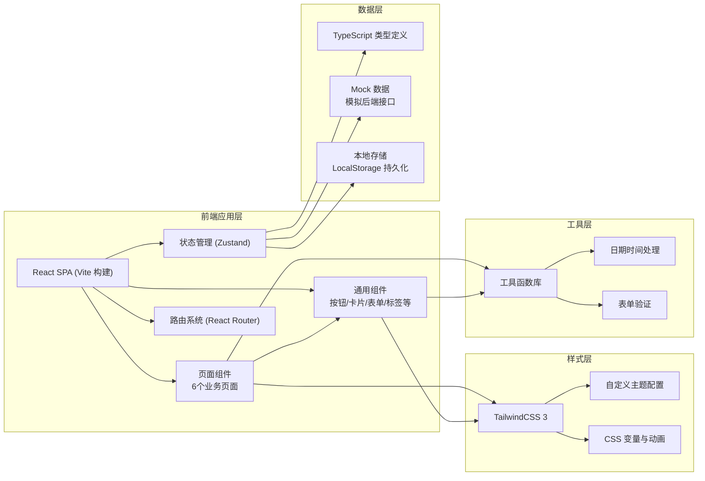
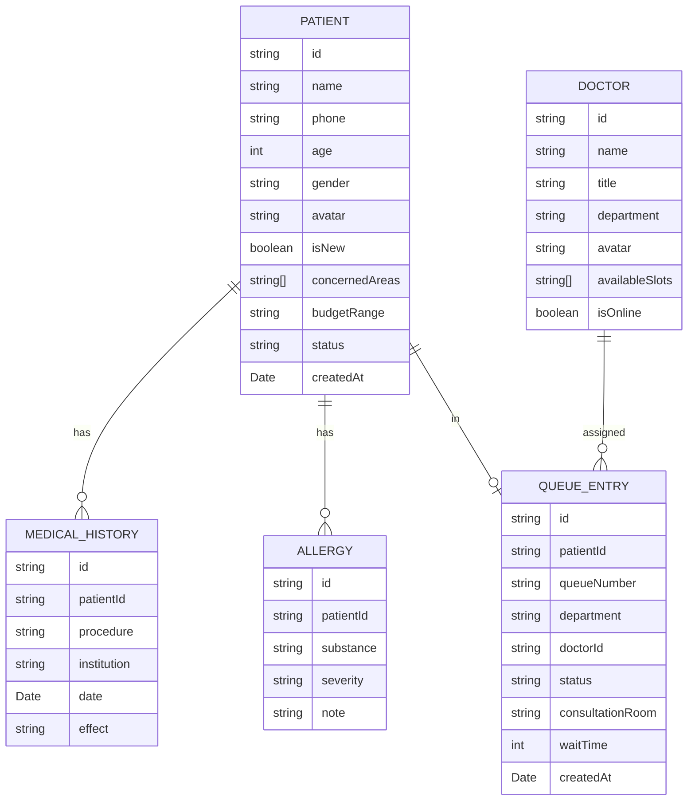

# 医美初诊分诊导诊工作台 - 技术架构文档

## 1. 架构设计



## 2. 技术栈说明

- **前端框架**: React 18 + TypeScript
- **构建工具**: Vite 5
- **样式方案**: TailwindCSS 3.4
- **状态管理**: Zustand
- **路由管理**: React Router v6
- **图标库**: Lucide React
- **数据方案**: Mock 数据 + LocalStorage 持久化（纯前端演示）

## 3. 目录结构

```
src/
├── components/          # 通用组件
│   ├── layout/         # 布局组件
│   │   ├── Sidebar.tsx
│   │   ├── Header.tsx
│   │   └── MainLayout.tsx
│   ├── ui/             # 基础UI组件
│   │   ├── Button.tsx
│   │   ├── Card.tsx
│   │   ├── Badge.tsx
│   │   ├── Input.tsx
│   │   ├── Select.tsx
│   │   ├── Modal.tsx
│   │   └── Tabs.tsx
│   └── shared/         # 业务共享组件
│       ├── PatientCard.tsx
│       ├── QueueCard.tsx
│       └── StatusTag.tsx
├── pages/              # 页面组件
│   ├── Registration.tsx    # 到院登记
│   ├── DemandCollection.tsx # 诉求采集
│   ├── RiskAssessment.tsx   # 风险提示
│   ├── DepartmentTriaging.tsx # 科室分流
│   ├── WaitingQueue.tsx     # 候诊队列
│   └── Dashboard.tsx        # 导诊看板
├── store/              # 状态管理
│   └── usePatientStore.ts
├── types/              # TypeScript 类型定义
│   └── index.ts
├── data/               # Mock 数据
│   ├── mockPatients.ts
│   ├── mockDoctors.ts
│   └── mockConfig.ts
├── utils/              # 工具函数
│   ├── format.ts
│   ├── validator.ts
│   └── time.ts
├── hooks/              # 自定义 Hooks
│   ├── useTimer.ts
│   └── useQueue.ts
├── App.tsx
├── main.tsx
└── index.css
```

## 4. 路由定义

| 路由路径 | 页面名称 | 说明 |
|----------|----------|------|
| `/` | 导诊看板 | 首页，全局概览 |
| `/registration` | 到院登记 | 新客登记、老客调取 |
| `/demand` | 诉求采集 | 关注部位、预算、历史记录 |
| `/risk` | 风险提示 | 风险评估、禁忌检测 |
| `/triaging` | 科室分流 | 科室选择、医生排班 |
| `/queue` | 候诊队列 | 队列管理、接单叫号 |

## 5. 数据模型

### 5.1 实体关系图



### 5.2 核心数据类型定义

```typescript
// 顾客信息
interface Patient {
  id: string;
  name: string;
  phone: string;
  age: number;
  gender: 'male' | 'female';
  avatar?: string;
  isNew: boolean;
  concernedAreas: string[];
  budgetRange: string;
  medicalHistory: MedicalHistory[];
  allergies: Allergy[];
  isPregnant: boolean;
  isLactating: boolean;
  riskLevel: 'low' | 'medium' | 'high';
  riskFactors: string[];
  status: 'registered' | 'pending_risk' | 'pending_triaging' | 'waiting' | 'consulting' | 'completed' | 'no_show' | 'rescheduled';
  department?: 'skin' | 'injection' | 'surgery';
  assignedDoctor?: string;
  consultationRoom?: string;
  queueNumber?: string;
  createdAt: Date;
  triagedAt?: Date;
  consultedAt?: Date;
  completedAt?: Date;
}

// 医美历史记录
interface MedicalHistory {
  id: string;
  procedure: string;
  institution: string;
  date: string;
  effect: 'good' | 'average' | 'poor';
  note?: string;
}

// 过敏记录
interface Allergy {
  id: string;
  substance: string;
  severity: 'mild' | 'moderate' | 'severe';
  note?: string;
}

// 医生信息
interface Doctor {
  id: string;
  name: string;
  title: string;
  department: 'skin' | 'injection' | 'surgery';
  avatar: string;
  availableSlots: string[];
  isOnline: boolean;
  currentPatients: number;
  todayCompleted: number;
}

// 候诊队列项
interface QueueItem {
  id: string;
  patientId: string;
  patient: Patient;
  queueNumber: string;
  department: 'skin' | 'injection' | 'surgery';
  doctorId?: string;
  status: 'waiting' | 'called' | 'consulting' | 'completed';
  consultationRoom?: string;
  waitTime: number;
  createdAt: Date;
}

// 统计数据
interface DashboardStats {
  todayArrivals: number;
  waitingCount: number;
  consultingCount: number;
  completedCount: number;
  noShowCount: number;
  avgWaitTime: number;
  avgConsultTime: number;
  avgTotalTime: number;
}
```

## 6. 状态管理设计

### 6.1 Zustand Store 结构

```typescript
// usePatientStore
interface PatientState {
  // 当前选中顾客
  currentPatient: Patient | null;
  // 今日顾客列表
  patients: Patient[];
  // 候诊队列（按科室分组）
  queues: {
    skin: QueueItem[];
    injection: QueueItem[];
    surgery: QueueItem[];
  };
  // 医生列表
  doctors: Doctor[];
  // 统计数据
  stats: DashboardStats;

  // Actions
  setCurrentPatient: (patient: Patient | null) => void;
  addPatient: (patient: Patient) => void;
  updatePatient: (id: string, data: Partial<Patient>) => void;
  addToQueue: (patientId: string, department: DepartmentType) => void;
  updateQueueItem: (id: string, data: Partial<QueueItem>) => void;
  removeFromQueue: (id: string) => void;
  assignDoctor: (queueId: string, doctorId: string) => void;
  markNoShow: (id: string) => void;
  markRescheduled: (id: string) => void;
  calculateStats: () => void;
}
```

## 7. 关键功能实现方案

### 7.1 计时器实现
- 使用 `useTimer` 自定义 Hook 实现等待时长计时
- 使用 `requestAnimationFrame` 或 `setInterval` 实现实时更新
- 基于创建时间计算，避免计时偏差

### 7.2 表单验证
- 手机号格式校验
- 必填项校验
- 自定义验证规则

### 7.3 风险等级计算
- 根据过敏史、孕期/哺乳期、禁忌症自动计算风险等级
- 高风险因素：严重过敏、孕期、近期手术史等
- 中风险因素：中度过敏、哺乳期等
- 低风险：无明显禁忌

### 7.4 智能分诊推荐
- 根据关注部位推荐科室
- 根据预算范围推荐医生等级
- 根据医生排班推荐可接诊时段

## 8. 性能优化策略

- 组件按需渲染，避免不必要的重渲染
- 使用 `useMemo` 和 `useCallback` 优化性能
- 列表使用虚拟滚动（如队列数据量大时）
- 图片懒加载
- 合理使用 CSS 动画，避免 JS 动画阻塞主线程

